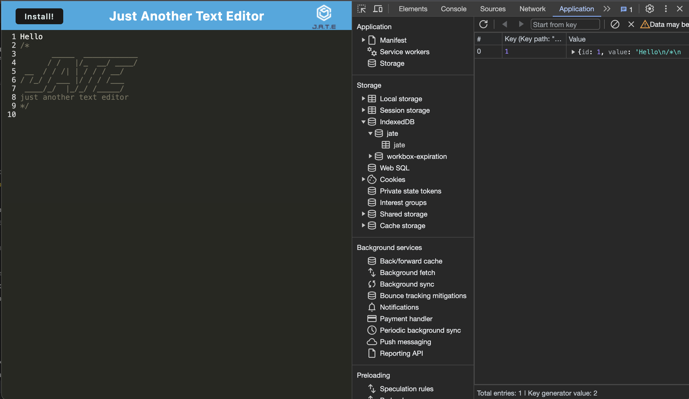

# pwa-text-editor

## Description
The motive behind this project was to build a text editor that runs in the browser.. I learned how to utilize webpack to bundle code and create an application that still functions offline.
 
## Installation
1. Clone from repo.
2. Open folder with visual studio code or any text editor of choice.
3. Run 'npm i' to install packages
4. Run 'npm run build' to build application
4. Run 'npm start' in terminal to run application.

## Usage
1. Open repo in terminal.
2. Run 'npm i' to install packages
3. Run 'npm run build' to build application
4. Run 'npm start' in terminal to run application.
5. Click install button on top left corner to install application

## Video Demo Link
[Click here for deployed Heroku link](https://git.heroku.com/pwa-text-editor529.git)